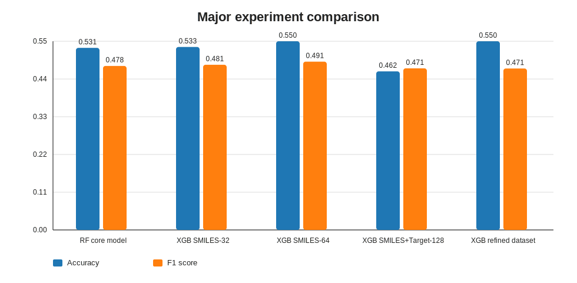

# Drug Side Effect Prediction using Molecular Structure and Target Action Features

본 연구에서는 약물의 분자 구조 정보(`SMILES`)와 target action 정보를 함께 활용하여 약물 부작용을 예측할 수 있는지 검토하였다. 초기 단계에서는 선별된 ADR 라벨을 대상으로 Random Forest 기준선을 구축하였고, 이후 공통 데이터셋 정비, XGBoost 비교 실험, 대규모 multi-label ADR 확장으로 연구를 전개하였다. 보존된 실험 결과를 기준으로 보면, 구조 정보만 사용한 XGBoost 설정이 가장 안정적인 F1-score를 보였으며, target action 정보를 결합한 설정은 recall을 높이는 방향의 보완 신호를 제공하였다.

## Abstract

This study examined whether adverse drug reactions can be predicted by combining molecular structure information (`SMILES`) with target action features. The work began with Random Forest baselines on curated ADR labels and later expanded toward shared dataset construction, XGBoost comparison studies, and large-scale multi-label ADR prediction. Across the preserved experiments, structure-only XGBoost settings showed the most stable F1-score, while feature fusion with target action information tended to improve recall and broaden sensitivity to positive cases.

## 연구 배경

약물 부작용 예측은 신약 개발과 약물 안전성 평가에서 중요한 문제이다. 본 연구에서는 화학 구조만으로는 설명되지 않는 부작용 신호를 보완하기 위해, 약물의 target action 정보를 함께 사용하였을 때 예측 성능이 어떻게 달라지는지를 확인하고자 하였다. 주요 실험 대상은 `THROMBOCYTOPENIA`였으며, 연구 전반에서는 구조 기반 특징, target 기반 특징, 그리고 두 특징의 결합 방식이 성능에 미치는 영향을 비교하였다.

## 연구 방향

1. DrugBank ID, `SMILES`, target action 정보를 정합화하여 공통 입력 데이터셋을 구축하였다.
2. `SMILES`로부터 Morgan fingerprint를 생성하고, 유사도 기반 특징 및 파생 입력을 구성하였다.
3. Random Forest, LightGBM, XGBoost를 이용하여 단일 부작용 예측 성능을 비교하였다.
4. 초기 단일 타깃 예측을 넘어, 보다 큰 ADR label space를 다루는 multi-label 확장 가능성을 탐색하였다.

## 연구 결과

보존된 `THROMBOCYTOPENIA` 실험 결과를 정리하면 다음과 같다.

| Experiment | Feature Setting | Accuracy | F1-score | ROC-AUC | Recall |
| --- | --- | ---: | ---: | ---: | ---: |
| RF core model | Structure + target | 0.531 | 0.478 | - | 0.533 |
| XGB SMILES-32 | SMILES only | 0.533 | 0.481 | 0.529 | 0.481 |
| XGB SMILES-64 | SMILES only | 0.550 | 0.491 | 0.544 | 0.481 |
| XGB SMILES+Target-128 | SMILES + target | 0.462 | 0.471 | 0.521 | 0.704 |
| XGB refined dataset | SMILES + target | 0.550 | 0.471 | 0.540 | 0.444 |



주요 결과만 기준으로 보면 `SMILES only` 64차원 XGBoost 설정이 가장 안정적인 F1-score를 보였다. 반면 `SMILES + target` 결합 설정은 recall을 높이는 경향을 보였으며, 구조 정보만으로 놓칠 수 있는 양성 사례를 더 포착할 가능성을 확인하였다. 다만 본 실험에서는 해당 이점이 동일한 수준의 F1 향상으로 이어지지는 않았다.

### 세부 비교 실험

#### XGBoost Feature Ablation

| Setting | Accuracy | F1-score | ROC-AUC | Recall |
| --- | ---: | ---: | ---: | ---: |
| SMILES only (32) | 0.533 | 0.481 | 0.529 | 0.481 |
| SMILES only (64) | 0.550 | 0.491 | 0.544 | 0.481 |
| SMILES + target (128) | 0.462 | 0.471 | 0.521 | 0.704 |
| Refined dataset + target (128) | 0.550 | 0.471 | 0.540 | 0.444 |


XGBoost 비교에서는 구조 정보만 사용한 설정이 F1-score 측면에서 가장 안정적이었다. target action 특징을 결합한 설정은 recall이 상승하여 민감도 측면의 가능성을 보였으나, 전체 균형 성능은 추가적인 feature selection과 regularization이 더 필요한 상태로 해석할 수 있었다.

#### Random Forest Historical Ablation

| CV / Sampling | Accuracy | F1-score | Recall |
| --- | ---: | ---: | ---: |
| 3-fold SMOTE | 0.617 | 0.508 | 0.615 |
| 7-fold SMOTE | 0.568 | 0.386 | 0.423 |
| 5-fold SMOTE | 0.543 | 0.275 | 0.269 |
| 10-fold SMOTE | 0.519 | 0.400 | 0.500 |
| 3-fold ADASYN | 0.642 | 0.540 | 0.654 |
| 5-fold ADASYN | 0.556 | 0.438 | 0.538 |
| 7-fold ADASYN | 0.556 | 0.419 | 0.500 |
| 10-fold ADASYN | 0.580 | 0.393 | 0.423 |
| 15-fold ADASYN | 0.556 | 0.419 | 0.500 |


초기 Random Forest 실험에서는 `3-fold + ADASYN` 조합이 가장 높은 F1-score를 기록하였다. 이는 초기 기준선 단계에서 fold 수 자체보다 sampling 전략이 성능에 더 직접적인 영향을 줄 수 있음을 시사한다.

결과 요약 CSV:

- [major_experiment_summary.csv](./drug-side-effect-research-assets/metrics/major_experiment_summary.csv)
- [xgboost_ablation_summary.csv](./drug-side-effect-research-assets/metrics/xgboost_ablation_summary.csv)
- [rf_ablation_summary.csv](./drug-side-effect-research-assets/metrics/rf_ablation_summary.csv)

## 향후 시도해볼 연구

1. target action 특징에 대해 feature selection과 regularization을 강화하여 구조 정보와의 결합 효용을 다시 평가할 필요가 있다.
2. time-based split 또는 external validation set을 도입하여 일반화 성능을 보다 엄밀하게 검증할 필요가 있다.
3. Morgan fingerprint 기반 표현을 넘어 graph neural network 또는 transformer 기반 분자 표현을 적용해볼 수 있다.
4. 단일 부작용 예측 실험을 정식 multi-label ADR 예측 파이프라인으로 확장하고, label imbalance에 대한 체계적인 대응 전략을 설계할 수 있다.

## 저장소 구성

```text
github_repos/
├── drug-target-action-preprocessing/
├── drug-side-effect-shared-datasets/
├── drug-side-effect-core-modeling/
├── drug-side-effect-xgboost-comparison/
├── drug-side-effect-xgboost-refined/
├── drug-side-effect-rf-baseline/
├── drug-side-effect-rf-results/
├── drug-side-effect-benchmark/
├── drug-side-effect-label-expansion/
├── drug-side-effect-multilabel-expansion/
├── drug-metadata-collection-tools/
├── drug-side-effect-experiment-archive/
└── drug-side-effect-research-assets/
```

## Author

- GitHub: [castle9612](https://github.com/castle9612)
