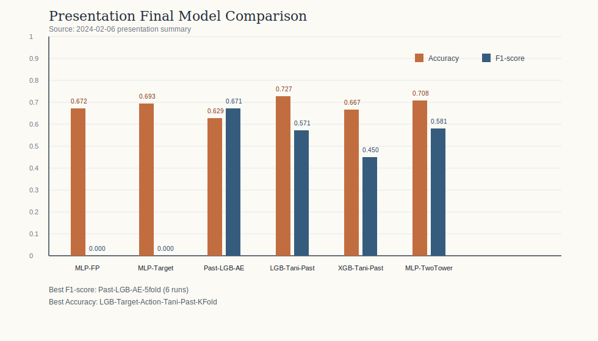
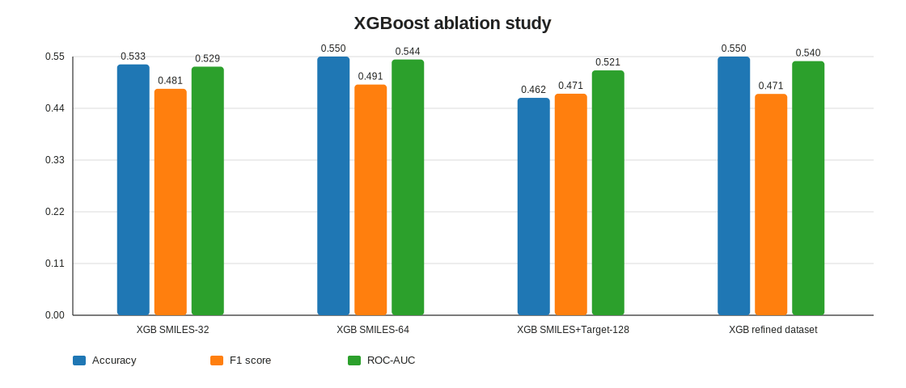
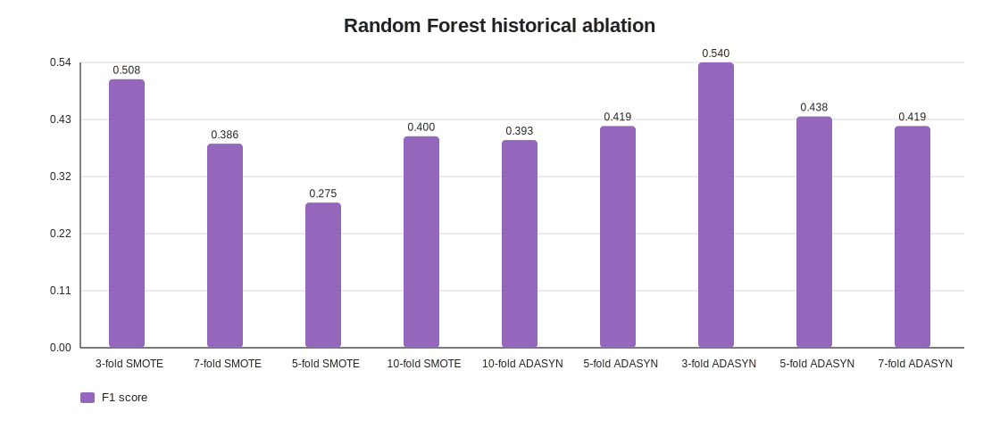

# Drug Side Effect Prediction using Molecular Structure and Target Action Features

본 연구에서는 약물의 분자 구조 정보(`SMILES`)와 target action 정보를 함께 활용하여 약물 부작용을 예측할 수 있는지 검토하였다. 연구는 초기 MLP 기준선에서 출발하여, AutoEncoder 기반 차원 축소, Tanimoto similarity, 과거 약물 기반 분할, LightGBM 및 XGBoost 비교, 그리고 two-tower 구조 실험으로 확장되었다. 본 README는 2024년 2월 6일 발표자료의 최종 비교표와 보존된 실험 로그를 함께 정리한 연구 아카이브 개요이다.

## Abstract

This study investigated whether adverse drug reactions can be predicted by combining molecular structure information (`SMILES`) with target action features. The work progressed from early MLP baselines to AutoEncoder-based compression, Tanimoto similarity features, past-drug splits, LightGBM and XGBoost comparisons, and a two-tower fusion model. This repository-level overview summarizes the final comparison reported in the presentation dated February 6, 2024, together with the preserved experiment logs.

## 연구 배경

약물 부작용 예측은 신약 개발과 약물 안전성 평가에서 중요한 문제이다. 본 연구에서는 화학 구조만으로는 설명되지 않는 부작용 신호를 보완하기 위해, 약물의 target action 정보를 함께 사용하였을 때 예측 성능이 어떻게 달라지는지를 확인하고자 하였다. 연구 전반에서는 구조 기반 특징, target 기반 특징, similarity 기반 특징, 그리고 이들의 결합 방식이 성능에 미치는 영향을 단계적으로 비교하였다.

## 연구 방향

1. `SMILES`를 fingerprint로 변환하고, target action matrix를 구성하여 초기 MLP 기준선을 설정하였다.
2. 구조 정보와 target action 정보를 각각 AutoEncoder로 압축하고, Tanimoto similarity를 추가하여 입력 표현을 확장하였다.
3. 과거 승인 약물 기반 데이터 구성과 k-fold 검증을 적용하여 LightGBM 및 XGBoost 성능을 비교하였다.
4. 최종적으로 구조 정보와 target action 정보를 분리 처리하는 two-tower 구조를 적용하여 late fusion 방식의 가능성을 검토하였다.

## 연구 결과

### 발표자료 기준 최종 모델 비교

2024년 2월 6일 발표자료의 최종 비교표를 기준으로 정리하면 다음과 같다.

| Model | Accuracy | F1-score | 해석 |
| --- | ---: | ---: | --- |
| `mlp-fpmatrix_09_25` | 0.6719 | 0.0000 | 구조 기반 초기 MLP 기준선 |
| `mlp-target_action_10_01` | 0.6931 | 0.0000 | target action 기반 초기 MLP 기준선 |
| `Past-lgb-AE-5fold(6회)` | 0.6288 | 0.6711 | 발표자료 기준 최고 F1-score |
| `lgb-target-action-tani-past-kfold` | 0.7273 | 0.5714 | 발표자료 기준 최고 accuracy |
| `Xg-target-action-tani-past-kfold` | 0.6667 | 0.4500 | XGBoost 비교 기준 모델 |
| `Mlp-twotower-5fold-tani` | 0.7083 | 0.5806 | two-tower 융합 구조 |



발표자료 기준으로 보면 `Past-lgb-AE-5fold(6회)` 설정이 가장 높은 F1-score를 기록하였고, `lgb-target-action-tani-past-kfold` 설정이 가장 높은 accuracy를 보였다. 이는 target action과 similarity 정보를 단순 결합하는 것보다, 압축 표현과 학습 설정의 조합이 성능에 더 큰 영향을 주었을 가능성을 시사한다. 또한 two-tower 구조는 최고 성능은 아니었지만, late fusion 방식이 일정 수준의 예측 성능을 확보할 수 있음을 보여주었다.

발표자료에는 위 표에 포함되지 않은 다른 모델들이 있었으나, 해당 자료에서는 F1-score가 0.0으로 학습되지 않은 경우를 중심으로 제외하여 정리하였다.

발표자료 요약 파일:

- [presentation_final_model_summary.csv](./drug-side-effect-research-assets/metrics/presentation_final_model_summary.csv)
- [240206.pptx](./drug-side-effect-experiment-archive/240206.pptx)

### 보존된 세부 실험 기록

보존된 CSV 실험 로그를 기준으로 정리한 `THROMBOCYTOPENIA` 중심 비교 결과는 다음과 같다.

| Experiment | Feature Setting | Accuracy | F1-score | ROC-AUC | Recall |
| --- | --- | ---: | ---: | ---: | ---: |
| RF core model | Structure + target | 0.531 | 0.478 | - | 0.533 |
| XGB SMILES-32 | SMILES only | 0.533 | 0.481 | 0.529 | 0.481 |
| XGB SMILES-64 | SMILES only | 0.550 | 0.491 | 0.544 | 0.481 |
| XGB SMILES+Target-128 | SMILES + target | 0.462 | 0.471 | 0.521 | 0.704 |
| XGB refined dataset | SMILES + target | 0.550 | 0.471 | 0.540 | 0.444 |

#### XGBoost Ablation

| Setting | Accuracy | F1-score | ROC-AUC | Recall |
| --- | ---: | ---: | ---: | ---: |
| SMILES only (32) | 0.533 | 0.481 | 0.529 | 0.481 |
| SMILES only (64) | 0.550 | 0.491 | 0.544 | 0.481 |
| SMILES + target (128) | 0.462 | 0.471 | 0.521 | 0.704 |
| Refined dataset + target (128) | 0.550 | 0.471 | 0.540 | 0.444 |



#### Random Forest Historical Ablation

| CV / Sampling | Accuracy | F1-score | Recall |
| --- | ---: | ---: | ---: |
| 3-fold SMOTE | 0.617 | 0.508 | 0.615 |
| 7-fold SMOTE | 0.568 | 0.386 | 0.423 |
| 5-fold SMOTE | 0.543 | 0.275 | 0.269 |
| 10-fold SMOTE | 0.519 | 0.400 | 0.500 |
| 3-fold ADASYN | 0.642 | 0.540 | 0.654 |
| 5-fold ADASYN | 0.556 | 0.438 | 0.538 |
| 7-fold ADASYN | 0.556 | 0.419 | 0.500 |
| 10-fold ADASYN | 0.580 | 0.393 | 0.423 |
| 15-fold ADASYN | 0.556 | 0.419 | 0.500 |



세부 로그 기준으로는 구조 정보만 사용한 XGBoost 설정이 상대적으로 안정적인 F1-score를 보였고, target action 정보를 결합한 설정은 recall을 높이는 방향의 특성을 보였다. 즉, 발표자료 기준 최종 비교와 보존된 CSV 로그는 서로 다른 시점의 연구 상태를 보여주며, 본 저장소는 두 흐름을 함께 보존하고 있다.

세부 로그 요약 파일:

- [major_experiment_summary.csv](./drug-side-effect-research-assets/metrics/major_experiment_summary.csv)
- [xgboost_ablation_summary.csv](./drug-side-effect-research-assets/metrics/xgboost_ablation_summary.csv)
- [rf_ablation_summary.csv](./drug-side-effect-research-assets/metrics/rf_ablation_summary.csv)

## 향후 시도해볼 연구

1. target action 특징에 대해 feature selection과 regularization을 강화하여 구조 정보와의 결합 효용을 다시 평가할 필요가 있다.
2. 발표자료 기준으로 성능이 높았던 `Past-lgb-AE-5fold` 계열 실험을 재현 가능한 코드 단위로 분리하여 다시 검증할 필요가 있다.
3. two-tower 구조를 보다 체계적으로 확장하여 early fusion과 late fusion의 차이를 직접 비교할 수 있다.
4. 단일 부작용 예측 실험을 정식 multi-label ADR 예측 파이프라인으로 확장하고, label imbalance에 대한 대응 전략을 정교화할 수 있다.

## 저장소 구성

```text
github_repos/
├── drug-target-action-preprocessing/
├── drug-side-effect-shared-datasets/
├── drug-side-effect-core-modeling/
├── drug-side-effect-xgboost-comparison/
├── drug-side-effect-xgboost-refined/
├── drug-side-effect-rf-baseline/
├── drug-side-effect-rf-results/
├── drug-side-effect-benchmark/
├── drug-side-effect-label-expansion/
├── drug-side-effect-multilabel-expansion/
├── drug-metadata-collection-tools/
├── drug-side-effect-experiment-archive/
└── drug-side-effect-research-assets/
```

## Author

- GitHub: [castle9612](https://github.com/castle9612)
